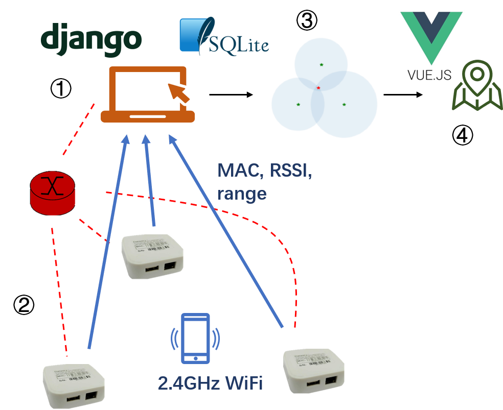
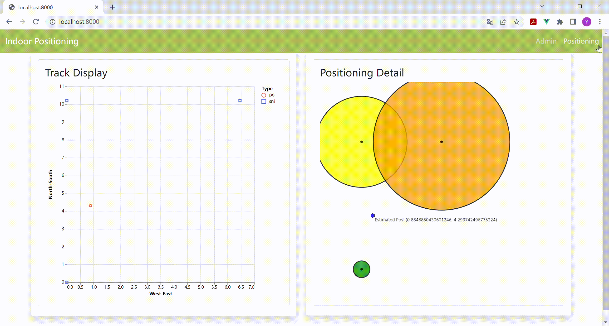

# Wireless signal perception and Indoor positioning

[中文](README.md) [English](README_EN.md)



### Dependencies

- Python
   - Backend language

- Django
   - Database provider
   - Back-end, which provides database support and services
   - Provides a simple front end and convenient background management page

   - Version >= 3.2
   - Possible problems with lower versions

      - Type annotation error
         - Type annotations won't affect execution, but may cause failure because `QuerySet` doesn't support `[]`.
         - Recommended solution (added before error code)
            `QuerySet.__class_getitem__ = classmethod(lambda cls, *args, **kwargs: cls)`
         - You can also comment all annotations involving `QuerySet[]` if you know it.

      - Background sidebar rendering

- Vue(Recommended, not necessary)
   - Front end, providing more refined interactive rendering pages

### How To Start

1. Install Django

   `pip install django`

2. Create migrations

   `python manage.py makemigrations`

3. Perform the migration

   `python manage.py migrate`

   Steps 1-3 are not required thereafter

4. View the local IP address (for deployment, optional)

   - Windows
      `ipconfig` -> WLAN -> IPv4(v6)
   
   - MacOS/Linux
      `ifconfig` -> addr

5. Run the development server

   `python manage.py runserver [[ip:]port]`

   - To deploy
      `python manage.py runserver $ip$:80`, where `$ip$` is the local IP in step 4

   - To debug
      `python manage.py runserver 0:80`
      `python manage.py runserver 80`
      `python manage.py runserver`

6. View services

   1. The output of step 5 should be similar to:
      ```
      Django version 3.2, using settings 'managing.settings'
      Starting development server at http://127.0.0.1:8000/
      Quit the server with CTRL-BREAK.
      ```

   2. Use the url in the 2nd line (http://127.0.0.1:8000/ in the example) to access the web page

      When the URL is not yet set, you should see a rocket on the page with following messages:
      ```
      The install worked successfully! Congratulations!
      You are seeing this page because DEBUG=True is in
      your settings file and you have not configured any URLs.
      ```

      Normally a simple page is rendered, containing the most recent record information.

7. Run the Vue front end

   `npm run serve`

   

8. Shut down the service

   Type Ctrl-break on the command line, the service will be shut down and the terminal will return to the input state.

### Advanced Operation

Once Django starts up properly, you can use more advanced actions to improve efficiency.

- Background Management

  1. Create an administrator account

     `python manage.py createsuperuser`

  2. Run Django

  3. Access the background and log in

     - direct access to the URL`project/admin`(http://127.0.0.1:8000/admin/)
     - Visit the home page of the project and click the hyperlink to jump to it

- Unit tests

  1. Create test cases inherited from `TestCase` in `indoor_positioning/tests.py`
  
     Each test case corresponds to a *scenario* or *environment*
  
  2. Define `setUp` to create a unified environment for the series of tests for this test case
  
  3. Write tests method that start with the 'test'
  
     **Note** : Each test will generate a **independent** instance and perform `setUp` once.
  
  4. Run the tests
  
     - With Django
       - `python manage.py test`
       - `python manage.py test [APP[.FILE[.CASE[.TEST]]]]`
       - Inconvenient, but safe
     - VSCode
       - Quick and automatic testing can be done through the test bar on the left side, and debugging and partial testing is supported, but **using production database**(will be restored after testing), there is data interference.
       - You can also use launch.json to create test configurations to perform Django's own tests and debug them.
     
     **Note** : The unit test will enable a separate temporary database without interfering with existing data.

### Directory Structure

Some documents have been omitted

```
├── manage.py                   Django startup file
├── managing                    configuration dir
│   ├── settings.py                 Django configuration
│   └── urls.py                     URLs
├── indoor_positioning          Core
│   ├── models.py                   database models
│   ├── views.py                    views, network service provider
│   ├── utils.py                    function tools, back end algorithm
│   ├── admin.py
│   └── tests.py                    unittests
├── algorithms/algorithms.ipynb interactively displays the algorithms
├── templates
│   ├── receive.html                Receive data page
│   ├── show_position.html          Positioning page based on Django
│   └── vue.html                    Positioning page based on Vue
├── static
├── frontend
├── README.md                   help
├── README_EN.md                English help
└── db.sqlite3                  temporary database, generated at first run
```

### Copyright

See [Chinese version](README.md#版权信息)
